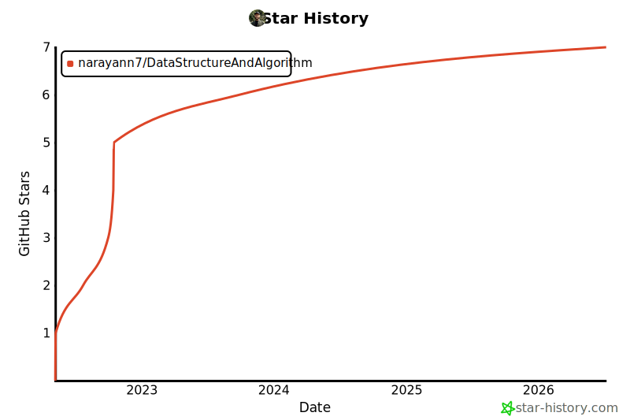
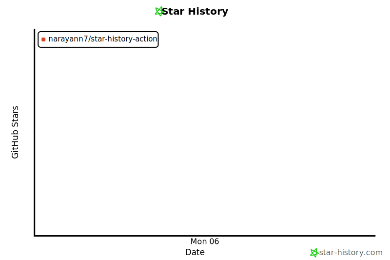

# Star History Action

Keep a star history chart in your README even though GitHub locked down the stargazers API.

On June 30, 2026 GitHub restricted the stargazers endpoint to a repo's own admins and collaborators, so `api.star-history.com/svg` now returns blank charts for most repos and README badges show nothing. A token that owns or collaborates on a repo can still read that repo's stargazer data, though. This action uses that fact: it runs in your CI, renders the chart with your own access, commits the SVG into your repo, and your README embeds the committed file. It does not touch the live SVG API at all.

The chart is drawn by [star-history's own code](https://github.com/star-history/star-history), vendored under `renderer/vendor` and run in Node. It produces the same SVG as star-history.com, with no headless browser and no third-party CLI. See `renderer/NOTICE.md` for the pinned commit and attribution.

## Demo

Live output of this action, charting [narayann7/DataStructureAndAlgorithm](https://github.com/narayann7/DataStructureAndAlgorithm):

<picture>
  <source media="(prefers-color-scheme: dark)" srcset="assets/demo/dark.svg">
  
</picture>

## Usage

Add `.github/workflows/star-history.yml`:

```yaml
name: Star History

on:
  push:
    branches: [main]
    paths-ignore:
      - 'assets/star-history/**'
  schedule:
    - cron: '0 0 * * *'
  workflow_dispatch:

permissions:
  contents: write

jobs:
  star-history:
    runs-on: ubuntu-latest
    steps:
      - uses: actions/checkout@v4
      - uses: narayann7/star-history-action@v1
        with:
          repos: ${{ github.repository }}
```

Then embed the result in your README:

```html
<picture>
  <source media="(prefers-color-scheme: dark)" srcset="assets/star-history/dark.svg">
  
</picture>
```

The `<picture>` block swaps the dark chart in automatically on GitHub's dark theme.

## Inputs

| input | default | description |
|---|---|---|
| `repos` | current repo | Comma-separated `owner/repo` list. |
| `output-dir` | `assets/star-history` | Where the SVGs are written. |
| `token` | `${{ github.token }}` | Token for the stargazers API. |
| `type` | `Date` | `Date` or `Timeline`. |
| `themes` | `light,dark` | Comma list of themes to render. |
| `width` | `800` | Image width in pixels. |
| `commit` | `true` | Commit and push the generated files. |
| `commit-message` | `chore: update star history [skip ci]` | Message used when committing. |

Output: `files`, a newline-separated list of the generated paths.

## Triggers

The workflow in Usage wires up three triggers, and you can keep or drop any of them:

- **push to `main`** refreshes the chart while you are actively committing. The `paths-ignore` on the output directory keeps the action's own chart commit from starting the workflow again.
- **schedule** picks up stars gained on days with no commits.
- **workflow_dispatch** gives you a manual run button.

### Cron intervals

Swap the `cron` line for whichever cadence fits. All times are UTC.

| interval | cron |
|---|---|
| 5m (testing only) | `*/5 * * * *` |
| 1h | `0 * * * *` |
| 3h | `0 */3 * * *` |
| 6h | `0 */6 * * *` |
| 12h | `0 */12 * * *` |
| daily | `0 0 * * *` |
| weekly | `0 0 * * 0` |

GitHub's minimum interval is 5 minutes, scheduled runs fire approximately rather than on the dot, and a repo with no activity for 60 days has its scheduled runs paused. Star counts move slowly, so daily is a fine default. Reach for 1h or 3h only if your repo gains stars fast enough that intraday updates matter.

## Token

The default `${{ github.token }}` is the automatic token GitHub injects into every workflow run, scoped to the repo the workflow lives in. For your own repo that is expected to satisfy the stargazers restriction. If a run comes back empty or unauthorized, generate a personal access token with the `public_repo` scope and pass it through the `token` input from a secret:

```yaml
        with:
          token: ${{ secrets.GH_PAT }}
```

Note that a token with no scopes no longer works against the stargazers endpoint.

## Limitation

You can only chart repos the token owns or collaborates on. Comparing arbitrary public repos you have no access to still fails, because that is exactly the data GitHub stopped handing out. Listing several of your own repos in `repos` works fine.

## License

MIT. See [LICENSE](./LICENSE).
