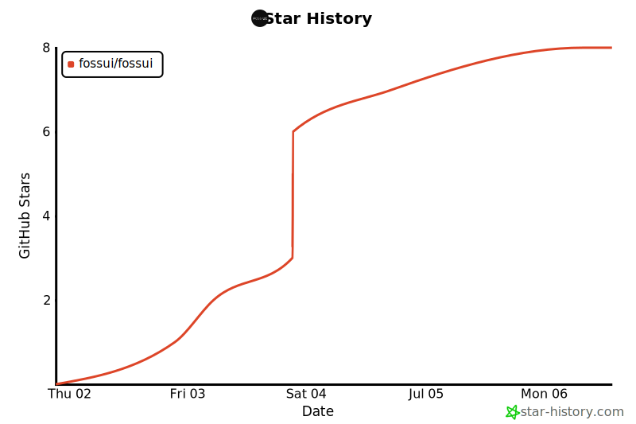

# Star History Action

Keep a self-updating star history chart in **your own** repository's README.

> **Unofficial.** This is a community project and is not affiliated with, endorsed by, or maintained by [star-history.com](https://www.star-history.com) or its team. It reuses their open-source renderer with credit (see [Credits](#credits)).

## Why

On June 30, 2026 GitHub limited its stargazers endpoint to a repo's own admins and collaborators. Since then the hosted `api.star-history.com/svg` badge renders blank for many repos, so live star-history README badges stopped working.

The access GitHub still allows is a repo's **owner or collaborator** reading **their own** repo's stargazers. This action leans on exactly that: it runs in your CI with your own access, renders the chart, and commits the SVG into your repo so the README embeds a static file. It is meant for charting repositories you own or collaborate on. It does not scrape star-history.com and does not embed any individual stargazer's identity, only the repository owner's avatar.

The chart is drawn by [star-history's own renderer](https://github.com/star-history/star-history), vendored under `renderer/vendor` and run in Node, so the output matches star-history.com without a headless browser or a third-party CLI. See `renderer/NOTICE.md` for the pinned commit and attribution.

## Demo

Live output of this action, charting [fossui/fossui](https://github.com/fossui/fossui), the repo from the [issue](https://github.com/star-history/star-history/issues/539) that motivated it. The action maintains this block itself through the marker comments below. (This repo is charted only as a demo of the motivating issue; the intended use is charting your own repositories, and doing so needs a token that can read the target's stargazers.)

<!-- star-history:start -->
<picture>
  <source media="(prefers-color-scheme: dark)" srcset="assets/star-history/star-history-dark-20260706134143.svg">
  
</picture>
<!-- star-history:end -->

## Usage

Add `.github/workflows/star-history.yml`:

```yaml
name: Star History

on:
  schedule:
    - cron: '0 */6 * * *'   # every 6 hours; see the interval table below
  workflow_dispatch:

permissions:
  contents: write

concurrency:
  group: star-history
  cancel-in-progress: false

jobs:
  star-history:
    runs-on: ubuntu-latest
    steps:
      - uses: actions/checkout@v4
      - uses: narayann7/star-history-action@v1
        with:
          repos: fossui/fossui   # or ${{ github.repository }} for the current repo
```

> **Recommended cadence: a scheduled run every 3h, 6h, or once a day.** Star
> counts move slowly, so anything more frequent just burns CI minutes and adds
> noise. Avoid the 5-minute cron (it exists only for quick testing) and avoid a
> `push` trigger: pushing on every commit re-runs the job constantly and adds
> churn for no benefit. Pick a schedule and let it run.

Then add these two marker comments to your README where you want the chart:

```html
<!-- star-history:start -->
<!-- star-history:end -->
```

Leave them empty. On each run the action fills the space between them with the
current chart and updates it when the chart changes:

```html
<!-- star-history:start -->
<picture>
  <source media="(prefers-color-scheme: dark)" srcset="assets/star-history/star-history-dark-20260706120000.svg">
  
</picture>
<!-- star-history:end -->
```

The filename carries a UTC timestamp that changes only when the chart changes.
That is deliberate: a new filename forces GitHub's image cache to fetch the
fresh chart instead of showing a stale one, and the action deletes the previous
timestamped files so the repo does not accumulate them. The `<picture>` block
also swaps the dark chart in automatically on GitHub's dark theme.

If you would rather manage the embed yourself, set `update-readme: false` and
point a plain `` at whatever the action writes.

## Inputs

| input | default | description |
|---|---|---|
| `repos` | current repo | Comma-separated `owner/repo` list. |
| `output-dir` | `assets/star-history` | Where the SVGs are written. |
| `token` | `${{ github.token }}` | Token for the stargazers API. |
| `type` | `Date` | `Date` or `Timeline`. |
| `themes` | `light,dark` | Comma list of themes to render. |
| `width` | `800` | Image width in pixels. |
| `update-readme` | `true` | Rewrite the README between the `star-history` marker comments to point at the newest chart. |
| `readme` | `README.md` | Path to the README to update. |
| `commit` | `true` | Commit and push the generated files. |
| `commit-message` | `chore: update star history [skip ci]` | Message used when committing. |

Outputs: `files` (newline-separated generated paths), `changed` (`true`/`false`), `light` and `dark` (the newest chart paths).

## Triggers

The recommended workflow uses two triggers:

- **schedule** runs the chart on a fixed cadence. This is the one you want.
- **workflow_dispatch** gives you a manual run button for the first run and ad-hoc refreshes.

A `push` trigger is also technically possible but **not recommended**: it re-runs the job on every commit, which wastes CI minutes and adds commit churn without meaningfully fresher data.

### Cron intervals

Swap the `cron` line for whichever cadence fits. All times are UTC.

| interval | cron | recommended |
|---|---|---|
| 5m | `*/5 * * * *` | no, testing only |
| 1h | `0 * * * *` | rarely |
| 3h | `0 */3 * * *` | yes |
| 6h | `0 */6 * * *` | yes (default) |
| 12h | `0 */12 * * *` | yes |
| daily | `0 0 * * *` | yes |
| weekly | `0 0 * * 0` | fine |

**Pick 3h, 6h, or daily.** Star counts move slowly, so that range is plenty. The 5-minute option is only for testing the setup; leaving it on burns CI minutes for identical charts. GitHub's minimum interval is 5 minutes anyway, scheduled runs fire approximately rather than on the dot, and a repo with no activity for 60 days has its scheduled runs paused.

## Token

The default `${{ github.token }}` is the automatic token GitHub injects into every workflow run, scoped to the repo the workflow lives in. For your own repo that satisfies the stargazers restriction, so **most users need no personal token at all**.

Only if a run fails as unauthorized (for example when charting a repo the default token cannot read) supply a personal access token through the `token` input from a secret:

```yaml
        with:
          token: ${{ secrets.GH_PAT }}
```

When you do need one, use the **least privilege that works**: a classic token with only the `public_repo` scope, or a fine-grained token with read-only access limited to the repositories you chart. Do not use a broad `repo`/`workflow` token. A token with no scopes does not work against the stargazers endpoint.

The `token` input is used **only to read stargazers**. The commit and push are authorized by the credentials `actions/checkout` persists (the workflow's default `GITHUB_TOKEN`), which is why `permissions: contents: write` is required. A PAT you pass here does not authorize the push. One consequence: because the push uses the default token, it does not trigger other `on: push` workflows, and it can be rejected on a branch with required status checks.

## Limitation

Charts need a token that can read the repo's stargazers. Your own repos always work with the default `${{ github.token }}`, and most other public repos work with a personal access token. GitHub's stargazers restriction can still block some repos, and when it does the chart comes back empty with no workaround.

## Credits

The chart rendering is powered by [star-history](https://github.com/star-history/star-history) (MIT). Their chart code is vendored under `renderer/vendor` and does all the real work of turning stargazer data into an SVG. This action is a thin wrapper that runs it in CI and commits the result. Thanks to the star-history maintainers.

## License

This project is MIT. See [LICENSE](./LICENSE).

It bundles star-history's code under `renderer/vendor`, which is also MIT. That license is kept intact at [`renderer/vendor/LICENSE`](./renderer/vendor/LICENSE), with attribution and the pinned commit in [`renderer/NOTICE.md`](./renderer/NOTICE.md).
